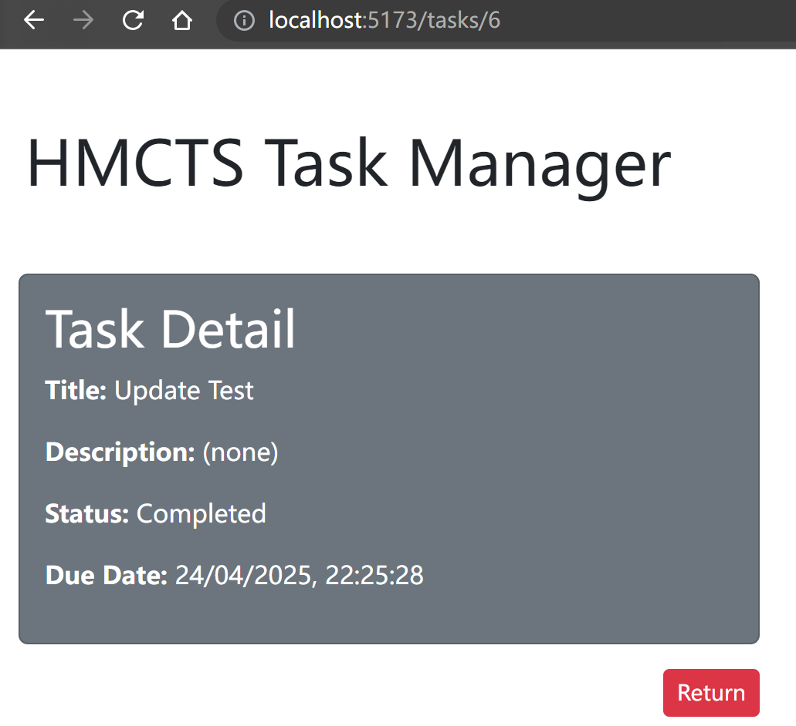

# HMCTS Task Manager - Full Stack Web Application

## Project Overview

This is a full stack web application built as a technical test solution for HMCTS.

It allows caseworkers to **create, view, update, and delete tasks**, with a clean and interactive user interface and a fully functional backend API.

---

## Tech Stack

- **Frontend**: React + TypeScript + Vite (Axios + React Router DOM)
- **Backend**: Spring Boot (Java 17) + H2 database + Spring Data JPA
- **API Communication**: Axios (RESTful)

## Project Structure

### Prerequisites

- Java 17+ & Maven (for backend)
- Node.js 16+ & npm (for frontend)

---

### Running the Backend (Spring Boot)

```bash
cd backend-SpringBoot
./mvnw spring-boot:run
```

The backend will start at: http://localhost:8080
Uses an in-memory H2 database by default

### Running the Frontend (React + Vite)

```bash
cd frontend-React
npm install
npm run dev
```

The frontend will start at: http://localhost:5173

## Frontend Features

✅ Add Task Fill out form (title, status, due date, optional description) / (homepage)
✅ View Tasks Displays all tasks with status & due time /
✅ Toggle Status One-click toggle between “Pending” and “Completed” /
✅ Delete Task Removes task from frontend and backend /
✅ View Detail Click task title to open a detail view with full information /tasks/:id

## Backend API Endpoints

GET /api/tasks Get all tasks
GET /api/tasks/{id} Get task by ID
POST /api/tasks Create a new task
PUT /api/tasks/{id}/status Update task status
DELETE /api/tasks/{id} Delete a task

## Task Data Structure (JSON)

{
"title": "Sample Task",
"description": "Optional notes",
"status": "Pending",
"dueDate": "2025-04-30T16:00:00"
}

## UI Screenshots

### Homepage – Create + View Tasks


### 🔍 Task Detail Page



## Future Improvements

- Edit task functionality

- Filter by status or due date

- Pagination for large task lists

- Authentication & access control with OAuth
